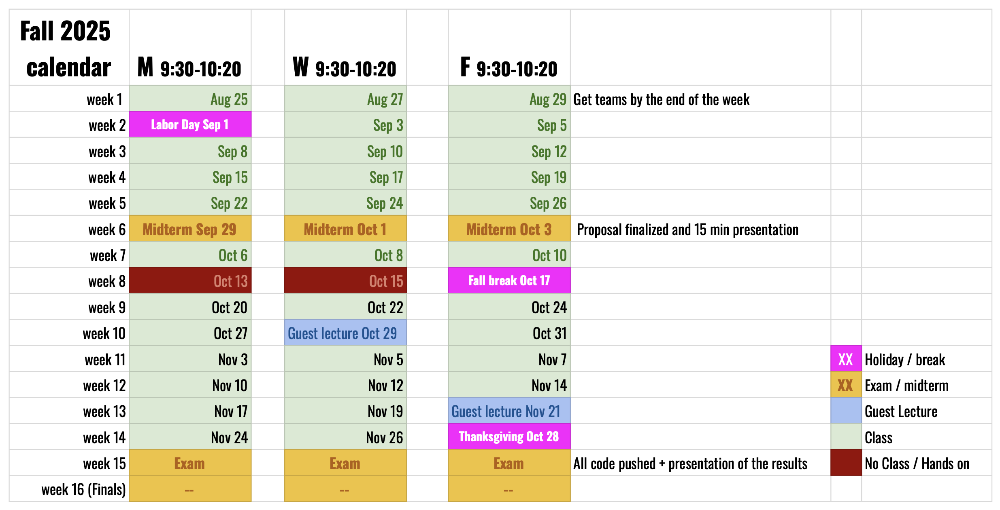

# Introduction to Deep Learning for data analysis 
## Physics & Astronomy Fall2025
This is the repository for the elective course on Machine Learning (Fall 2025)

### Content: 
You can find more details on the course outline on the [wiki](https://github.com/nmik/P-A_ML_Fall2025/wiki).

### Course Description:
This course offers a hands-on, code-first introduction to machine learning with a focus on deep learning. We will follow the interactive textbook Dive into Deep Learning and use Python and PyTorch throughout the course to implement key algorithms and models. You will gain practical experience by building, training, and analyzing machine learning models, with an emphasis on modern techniques used in research.

### Resources:
- _Primary Textbook_ (Free): [Dive into Deep Learning](https://d2l.ai) by Aston Zhang, Zachary C. Lipton, Mu Li, and Alexander J. Smola.
- _Other Textbook_ (not Free, not required): Probabilistic Machine Learning, An Introduction - Kevin P. Murphy 
- _Other resources_: Papers and other resources may be provided throughout the course

### Exams:
- _Midterm_: Sep 29 / Oct 1 / Oct 3, type: project proposal/presentation (i.e., define the problem to solve and possible ML approaches that could be applied)
- _FInal_: Dec 1 / Dec 3 / Dec 5, type: Actuation of the proposed project (code submitted through GitHub + document/slides presenting the results)

### Quick-look calendar

A more detailed calendar is available [here](https://docs.google.com/spreadsheets/d/161N_264dD8lJprTzIt-peCLHdnkwgoNFKvrW_4uoEZI/edit?gid=273294743#gid=273294743) and continuosly updated.

### Expected Background and Prerequisites:
To get the most out of this course, students are expected to have:
- Familiarity with object-oriented programming (OOP) concepts and syntax
- Basic programming skill 
  - best if in Python, in particular experience using core Python libraries such as numpy, matplotlib, and pandas (basic like opening and managing a .csv or txt file with a data set).
  - Here some resources if you need refreshers of place where to start: [Pure python basics](https://github.com/jvdkwast/Python3_Jupyter_Notebook/blob/7fa1d238d56b8baa6f19a90a37c273f8699c2bad/PythonIntro.ipynb), [Numpy-Pandas-Matplotlib tutorials](https://github.com/veb-101/Numpy-Pandas-Matplotlib-Tutorial?tab=readme-ov-file)

While no prior experience with GitHub or Conda is assumed, we will make use of both. Instruction will be limited to what’s strictly needed to support the course activities. Students who wish to become more comfortable with GitHub or Conda are encouraged to explore external resources (feel free to ask me for suggestions).

### Additional Learning Opportunity:
Students are highly encouraged to attend the [LSU AI Journal Club](https://www.lsu.edu/science/news_events/ai-journal-club.php), an interdisciplinary venue to explore the latest applications of machine learning across science and engineering. To receive updates and announcements about the AI-JC, you can subscribe (and unsubscribe anytime after the course) to the mailing list here: [AI-JC Sign-Up](https://mail.cct.lsu.edu/mailman/listinfo/ai-club)

### What is not considered cheating in this course:
- Collaborating with others to seek suggestions and feedback—especially from machine learning experts at the AI Journal Club—is not considered cheating; in fact, it is strongly encouraged, provided that others do not write or implement code for you.
- Similarly, using tools like ChatGPT to help you write code or explore possible machine learning techniques is not only allowed but reflects real-world practices. However, you are still expected to:
  - Research the methods you decide to use by reading relevant literature and clearly articulating why you chose them for your specific problem.
  - Understand and explain your code thoroughly—this includes being able to describe what each part of your implementation does, line by line.

__________________________________________
By Michela Negro (Instructor)
with the help of Mohammad Ali Boroumand (TA)
